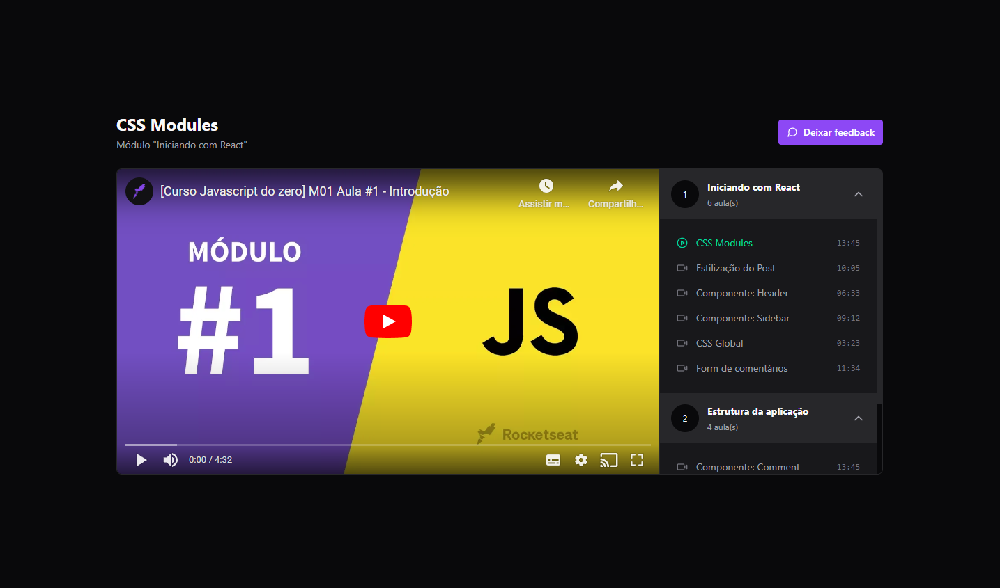

<h1 align="center">
    
</h1>

<p align="center">
  <a href="#-project">Project</a>&nbsp;&nbsp;&nbsp;|&nbsp;&nbsp;&nbsp;
  <a href="#-technologies">Technologies</a>&nbsp;&nbsp;&nbsp;|&nbsp;&nbsp;&nbsp;
  <a href="#-how-to-run">How to run</a>
</p>

<p align="center">
  
</p>

## 💻 Project

Module player clone app developed during Rocketseat's Ignite using <b>React.js</b>, <b>TypeScript</b>, styles with <b>Tailwind</b>, icons with <b>Lucide React</b>, player component with <b>React Player</b>, data fetching with <b>Axios</b>, local back-end with <b>Json-Server</b>, collapsible component with <b>Radix</b> and global state management with <b>Redux</b> and <b>Zustand</b>.

## 🔧 Technologies

- [React.js](https://react.dev/)
- [TypeScript](https://www.typescriptlang.org/)
- [Tailwind](https://tailwindcss.com/)
- [Redux](https://redux.js.org/)
- [Zustand](https://zustand-demo.pmnd.rs/)
- [Axios](https://axios-http.com/docs/intro)
- [Json-Server](https://github.com/typicode/json-server)
- [Radix](https://www.radix-ui.com/)
- [React Player](https://cookpete.com/react-player/)
- [Lucide](https://lucide.dev/)

## 😊 How to run

Before starting, you need to have [Git](https://git-scm.com) and [Node](https://nodejs.org/en/) installed on your machine.

```sh
- Clone this repo:
$ git clone https://github.com/marcelopajr/ignite-react-redux-zustand.git

- Enter directory:
$ cd ignite-react-redux-zustand

- Install dependencies:
$ npm install

- Launch the server:
$ npm run server

- Launch the app:
$ npm run dev
```

Have fun!
